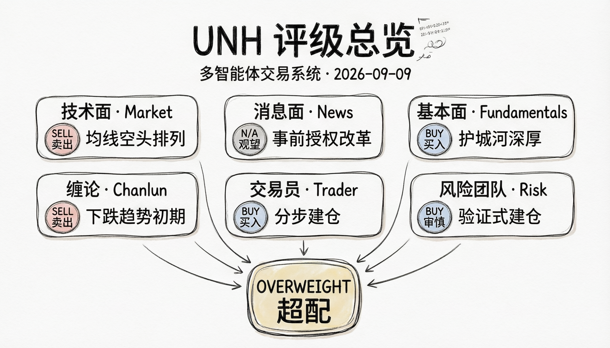
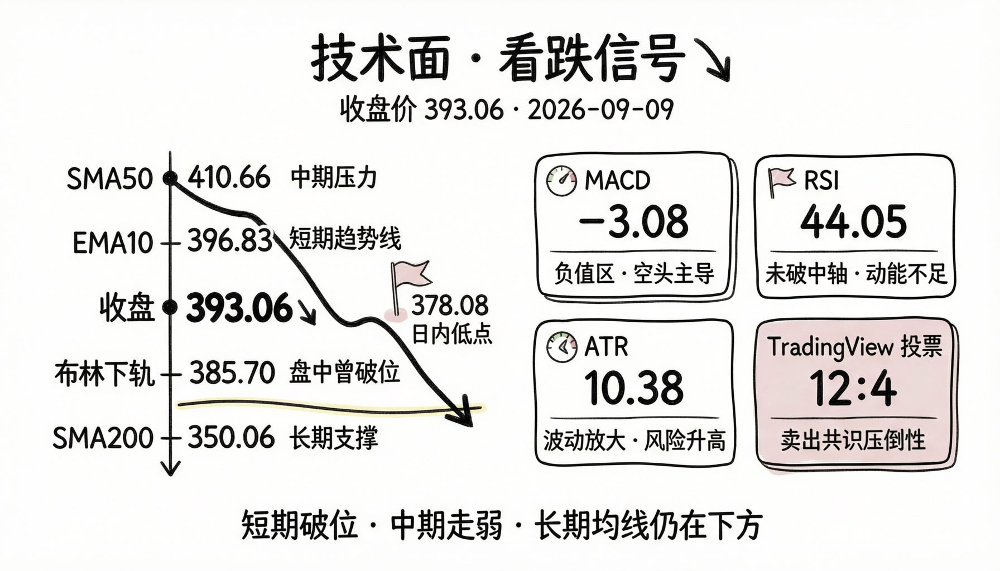
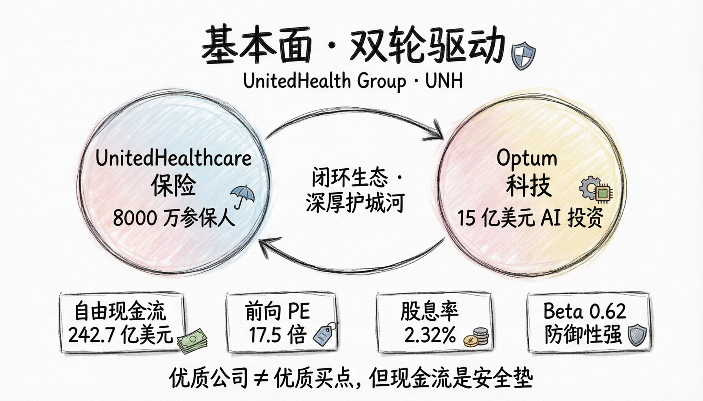
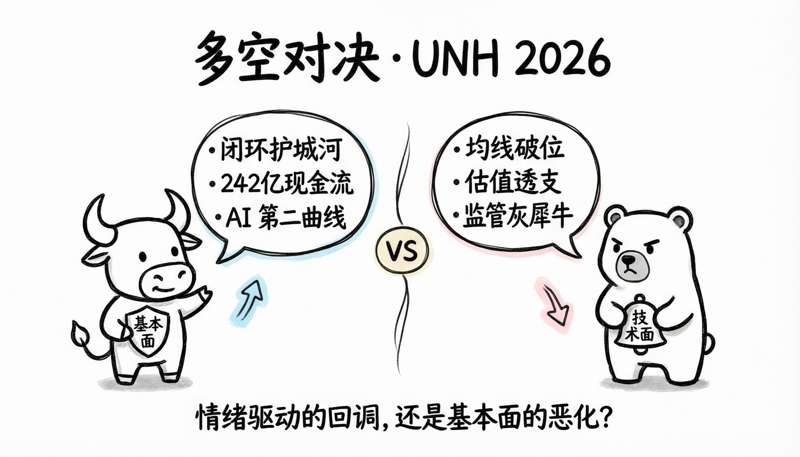
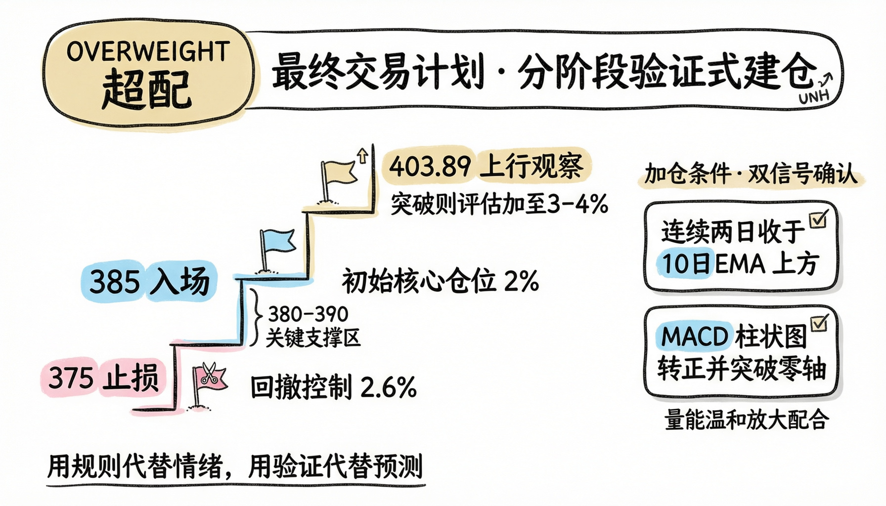

# Trading Analysis Report: UNH

Generated: 2026-09-10 19:07:56

## Executive Summary

**Final Rating: Overweight**

| Role | Rating | Key Point |
|------|--------|-----------|
| Market Analyst | Sell | 联合健康集团（UNH）截至2026年9月9日的技术面分析呈现出明显的看跌信号，建议采取**卖出**策略。以下是基于多维度技术指标和市场数据的详细分析： |
| News Analyst | N/A | 在过去一周，联合健康集团（UNH）展现了积极的战略调整态势。公司宣布从10月1日起，其保险部门UnitedHealthcare将取消大量医疗服务的事前授权要求，这是其实现到2026年底消除30%医疗服务事前授权目标的重要一步。此举有望减少患者、医疗服务提供者和保险公司自身的行政负担。 |
| Fundamentals Analyst | Buy | 联合健康集团（UnitedHealth Group Incorporated，股票代码：UNH）是美国领先的多元化医疗保健公司，业务主要分为两大板块：联合健康保险（UnitedHealthcare）和Optum。公司属于医疗保健行业中的健康保险子行业，在纽约证券交易所上市。 |
| Chanlun Analyst | Sell | 根据缠论（Chan Theory）对UNH截至2026年9月9日的日线结构分析，当前市场处于明确的**下跌趋势初期**，具备高确定性的做空机会。以下是详细解读： |
| Research Manager | N/A | **Recommendation**: Overweight |
| Trader | Buy | 分析师报告指出，尽管UNH面临短期技术面破位和监管压力等风险，但其核心优势稳固：UnitedHealthcare与Optum构成的闭环生态、卓越的战略执行力以及强劲的财务状况（超240亿美元自由现金流）构成了深厚护城河。当前回调被视为情绪驱动，而非基本面恶化，长期增长路径依然清晰。 |
| Aggressive Analyst | N/A | Aggressive Analyst: 各位同事，我必须直言——当前对UNH的“卖出”或“观望”建议，本质上是被短期技术噪音蒙蔽了双眼，错把战术性回调当成战略性崩盘。让我一条条拆解那些保守观点，并用事实和数据证明：此刻正是以385美元果断买入、甚至准备加仓的黄金窗口！ |
| Conservative Analyst | N/A | Conservative Analyst: 各位同事，我理解Aggressive Analyst对UNH基本面的信心，也认同公司确有强大的护城河和现金流能力。但作为保守风险分析师，我的职责不是被“每天净赚6600万美元”这样的宏大叙事所吸引，而是冷静审视：**在当前价格和市场环境下，这笔交易是... |
| Neutral Analyst | N/A | Neutral Analyst: 各位同事，感谢Aggressive和Conservative两位分析师的精彩论述——一个高举基本面大旗、坚信“回调即机会”，另一个紧握技术与宏观警钟、强调“宁可错过也不犯错”。但作为Neutral Risk Analyst，我认为你们各自都抓住了真相的一部分，... |
| Portfolio Manager | Overweight | 建议对UNH采取“超配”评级。初始以2%仓位在385美元附近建立核心观察仓，若价格在380-390美元关键支撑区企稳，并同时出现连续两日收于10日EMA上方及MACD突破零轴等技术反转信号，则逐步加仓。止损位设于375美元以控制风险。 |

## I. Analyst Team Reports

### Market Analyst
FINAL TRANSACTION PROPOSAL: **SELL**

联合健康集团（UNH）截至2026年9月9日的技术面分析呈现出明显的看跌信号，建议采取**卖出**策略。以下是基于多维度技术指标和市场数据的详细分析：

### 趋势结构：短期与中期均线均呈空头排列
从移动平均线系统来看，UNH当前处于明确的下行趋势中：
- **10日指数移动平均线（EMA）** 为396.83，而当日收盘价393.06已明显跌破该短期趋势线，表明短期动能转弱。
- **50日简单移动平均线（SMA）** 高达410.66，当前价格远低于此关键中期支撑位，差距约4.3%，显示中期趋势偏空。
- 尽管**200日SMA**（350.06）仍处于下方并提供长期支撑，但TradingView的投票数据显示，短期至中期的多条均线（EMA10/20/30/50、SMA10/20/30/50）均发出“卖出”信号，形成空头排列。

### 动量指标：MACD与RSI确认弱势
动量指标进一步验证了下跌动能：
- **MACD** 指标值为-3.08，虽高于信号线（-4.04），呈现柱状图（0.96）为正，但整体仍处于负值区域，表明市场情绪偏空。值得注意的是，MACD近期从8月下旬的-7.24低点有所回升，但这更可能是下跌过程中的技术性反弹，而非趋势反转。
- **相对强弱指数（RSI）** 为44.05，处于中性区间，既未超买也未超卖。然而，结合价格走势，RSI未能有效突破50中轴，反映出多头力量不足。

### 波动率与布林带：价格触及下轨，但未现反转迹象
- **布林带** 下轨为385.70，9月9日最低价378.08已显著跌破下轨，显示市场出现恐慌性抛售。然而，收盘价393.06重新回到布林带内（385.70-406.42），这种“破底返”形态通常需要后续阳线确认才能视为反转信号，目前尚无此迹象。
- **平均真实波幅（ATR）** 为10.38，较前几日（约8.6-9.0）明显放大，表明市场波动加剧，这与9月9日的大阴线（振幅达6.9%）相吻合，凸显了当前市场的不确定性及下行风险。

### TradingView共识：强烈卖出建议
TradingView的综合技术分析给出了明确的“**卖出**”评级，其中：
- **移动平均线投票**：12票卖出 vs. 4票买入，空头占据绝对优势。
- **震荡指标投票**：多数指标（如RSI、CCI、ADX等）呈中性，但动量（Mom）指标明确指向卖出，仅MACD给出买入信号，但其力度不足以扭转整体空头格局。

### 关键价格水平与风险提示
- **阻力位**：上方首要阻力在10日EMA（396.83）及9月8日高点403.89。若无法有效收复396.83，反弹将受限。
- **支撑位**：下方初步支撑在布林带下轨385.70，若跌破则可能下探前期低点384.85（8月20日）甚至380一带。
- **风险事件**：9月9日单日成交量高达773万，显著高于近期均值，显示资金出逃意愿强烈，需警惕进一步下行风险。

综上所述，UNH当前技术面呈现短期破位、中期走弱、动量不足且市场共识偏空的局面。尽管长期趋势（200日均线）仍向上，但短期内缺乏有效支撑和反转信号，建议投资者逢高减仓或持有空头头寸。

| 分析维度 | 关键指标 | 当前值 | 信号解读 |
| :--- | :--- | :--- | :--- |
| **趋势方向** | 10日EMA | 396.83 | 价格跌破，短期趋势转空 |
| | 50日SMA | 410.66 | 价格远低于此，中期承压 |
| | 200日SMA | 350.06 | 长期支撑，但短期影响有限 |
| **动量强度** | RSI | 44.05 | 中性，多头动能不足 |
| | MACD | -3.08 | 负值区域，空头主导 |
| **波动与通道** | 布林带下轨 | 385.70 | 盘中破位后收回，需观察能否企稳 |
| | ATR | 10.38 | 波动放大，风险升高 |
| **市场共识** | TradingView总评 | SELL | 12票卖出 vs. 4票买入，空头占优 |

### News Analyst
### 联合健康集团（UNH）及宏观环境综合分析报告

#### 公司特定动态：运营优化与战略调整并行

在过去一周，联合健康集团（UNH）展现了积极的战略调整态势。公司宣布从10月1日起，其保险部门UnitedHealthcare将取消大量医疗服务的事前授权要求，这是其实现到2026年底消除30%医疗服务事前授权目标的重要一步。此举有望减少患者、医疗服务提供者和保险公司自身的行政负担。

同时，UNH正通过资产剥离来优化业务组合。公司已将其在佛罗里达州部分Optum Health业务的权益出售给私募股权公司TPG。这一举措是公司从去年利润下滑中恢复的一部分战略，尽管短期内导致股价下跌约3%，但长期看有助于聚焦核心盈利业务。

值得注意的是，UNH正在人工智能领域进行近15亿美元的投资，以扩展Optum Insight的软件产品，提高效率并开拓新的增长机会。知名投资者Jim Cramer也对UNH的盈利增长前景表示肯定，认为其"确实拥有足够的盈利增长"。

然而，市场对UNH也存在一些担忧。一方面，CVS Health在投资者会议上提到"高趋势"医疗成本增长持续，这可能对管理式医疗投资者情绪产生负面影响。另一方面，UNH虽然运营利润率在同行中最佳，但收入增长却是三家中最慢的，且估值溢价显著高于同行Cigna。

#### 宏观经济环境：稳定通胀与紧缩预期

当前宏观经济环境对医疗保健行业整体有利。消费者价格指数（CPI）最新数据显示，2026年7月CPI为332.813，较6月仅微增0.07%，表明通胀压力得到有效控制。失业率维持在4.1%的低位，显示劳动力市场依然健康。

联邦基金利率稳定在3.63%，而10年期国债收益率近期有所上升，从8月10日的4.72%升至9月8日的4.8%。预测市场数据显示，市场对2026年美联储不会降息的概率高达93%，表明市场预期货币政策将保持相对紧缩。

关于经济衰退风险，预测市场显示美国在2026年底前出现衰退的概率仅为8%，处于较低水平。这为医疗保健等防御性板块提供了相对稳定的宏观环境。

#### 投资启示

UNH近期表现强劲，过去六个月股价上涨39.4%，跑赢标普500指数25.4个百分点。公司的战略调整——包括简化医疗服务审批流程、剥离非核心资产以及加大对AI技术的投资——显示出管理层致力于提高运营效率和盈利能力的决心。

尽管面临医疗成本上升的压力和相对较高的估值，但UNH作为医疗保健计划领域的龙头企业，在稳定的宏观环境下，其业务模式具有较强的抗周期性。随着公司继续优化运营并聚焦高利润业务，长期增长前景依然可观。

| 关键指标 | 数据/事件 | 影响分析 |
|---------|----------|---------|
| **UNH事前授权改革** | 取消30%医疗服务事前授权 | 降低行政成本，提升患者体验，但需关注医疗成本控制 |
| **Optum资产剥离** | 向TPG出售佛罗里达州业务 | 短期股价承压，长期有利于业务聚焦和利润修复 |
| **AI投资** | 15亿美元投入Optum Insight | 增强技术竞争力，开拓新增长点 |
| **通胀水平** | CPI环比增长0.07% | 通胀受控，有利于医疗保健支出稳定 |
| **利率环境** | 联邦基金利率3.63%，10年期国债收益率4.8% | 利率环境稳定，无明显宽松预期 |
| **衰退风险** | 2026年衰退概率8% | 经济前景稳健，利好防御性板块 |
| **就业市场** | 失业率4.1% | 劳动力市场健康，支撑医疗保健需求 |

### Fundamentals Analyst
FINAL TRANSACTION PROPOSAL: **BUY**

# 联合健康集团（UNH）基本面分析报告

## 公司概况
联合健康集团（UnitedHealth Group Incorporated，股票代码：UNH）是美国领先的多元化医疗保健公司，业务主要分为两大板块：联合健康保险（UnitedHealthcare）和Optum。公司属于医疗保健行业中的健康保险子行业，在纽约证券交易所上市。

## 财务表现概览

### 盈利能力分析
根据最新季度财报（截至2026年6月30日），联合健康集团展现出强劲的盈利能力：
- 季度总收入达1,120.32亿美元，保持稳定增长态势
- 季度净利润为54.84亿美元，基本每股收益为6.06美元
- 毛利率约为20.8%（232.99亿美元毛利润/1,120.32亿美元总收入）
- 运营利润率约为7.1%（79.91亿美元运营收入/1,120.32亿美元总收入）

从年度数据看，公司TTM（过去12个月）净利润达141.22亿美元，利润率为3.14%，EBITDA为266.81亿美元，显示出稳健的盈利能力和运营效率。

### 现金流状况
联合健康集团的现金流表现强劲：
- 最新季度经营性现金流达110.52亿美元
- 自由现金流达102.53亿美元（经营性现金流减去资本支出）
- 年度自由现金流总计242.72亿美元

强劲的自由现金流使公司能够维持稳定的股息支付（季度股息约20.87亿美元）并进行股票回购，同时支持业务扩张和战略收购。

### 资产负债状况
截至2026年6月30日，公司资产负债表显示：
- 总资产：3,097.27亿美元
- 总负债：2,037.78亿美元
- 股东权益：984.47亿美元
- 负债权益比：69.21%
- 流动比率：0.777（低于1，但对保险公司属正常水平）

值得注意的是，公司持有大量现金及现金等价物（285.85亿美元）和短期投资，流动性充足。虽然流动比率低于1，但这在保险行业较为常见，因为保险公司通常持有大量长期资产用于匹配长期负债。

### 债务管理
公司总债务为733.28亿美元，净债务（总债务减去现金及等价物）为447.43亿美元。近期数据显示公司正在积极管理债务：
- 2026年第二季度偿还债务33.13亿美元
- 同期发行新债11亿美元，净减少债务22.13亿美元

这表明公司正采取措施优化资本结构，降低财务杠杆。

## 估值指标分析
当前市场对联合健康集团的估值指标如下：
- 市盈率（TTM）：25.24
- 前向市盈率：17.52
- PEG比率：1.08
- 市净率：3.61
- 股息收益率：2.32%

前向市盈率明显低于TTM市盈率，表明市场预期公司未来盈利将有显著增长。PEG比率接近1，说明当前股价与公司增长前景基本匹配，估值合理。

## 投资亮点与风险

### 投资亮点
1. **业务多元化**：公司通过UnitedHealthcare和Optum两大业务板块实现收入来源多元化，降低了单一业务风险。
2. **稳定增长**：季度收入持续稳定在1,100亿美元以上，显示出强大的市场地位和定价能力。
3. **强劲现金流**：自由现金流充裕，支持股息增长和股票回购，为股东创造价值。
4. **防御性行业**：医疗保健行业具有较强的经济周期防御性，即使在经济下行期也能保持相对稳定的业绩。
5. **低Beta值**：Beta值为0.622，表明股价波动性低于大盘，适合寻求稳定回报的投资者。

### 潜在风险
1. **监管风险**：医疗保健行业面临严格的政府监管，政策变化可能影响公司业务模式和盈利能力。
2. **医疗成本通胀**：医疗成本持续上涨可能压缩保险业务的利润率。
3. **竞争加剧**：医疗保健市场竞争日益激烈，可能导致价格压力和市场份额争夺。
4. **技术变革**：医疗技术快速变革要求公司持续投入研发和系统升级，增加运营成本。

## 技术面参考
- 当前股价接近52周高点（461.62美元）
- 明显高于50日均线（411.20美元）和200日均线（351.93美元）
- 表明当前处于强势上涨趋势中

## 投资建议
基于对公司基本面的全面分析，联合健康集团展现出稳健的财务状况、强劲的现金流生成能力和合理的估值水平。尽管存在行业监管和医疗成本通胀等风险，但公司的业务多元化、市场领导地位和防御性特征使其成为长期投资的优质选择。

考虑到公司强劲的自由现金流、稳定的股息收益率（2.32%）以及预期的盈利增长，建议**买入**该股票作为长期投资组合的核心持仓。

| 关键指标 | 数值 | 分析意义 |
|---------|------|---------|
| 市值 | 3,528.09亿美元 | 大型蓝筹股，市场认可度高 |
| TTM市盈率 | 25.24 | 合理估值，反映优质资产溢价 |
| 前向市盈率 | 17.52 | 预期未来盈利增长显著 |
| 股息收益率 | 2.32% | 提供稳定现金流回报 |
| 自由现金流 | 242.72亿美元(年度) | 现金流充裕，支持业务发展和股东回报 |
| 负债权益比 | 69.21% | 财务杠杆适中，风险可控 |
| Beta值 | 0.622 | 波动性低于大盘，防御性强 |
| ROE | 14.15% | 股东回报率良好 |
| 最新季度净利润 | 54.84亿美元 | 盈利能力强劲且稳定 |
| 现金及等价物 | 285.85亿美元 | 流动性充足，财务安全边际高 |

### Chanlun Analyst
FINAL TRANSACTION PROPOSAL: **SELL**

根据缠论（Chan Theory）对UNH截至2026年9月9日的日线结构分析，当前市场处于明确的**下跌趋势初期**，具备高确定性的做空机会。以下是详细解读：

---

### 1. 当前结构位置

- 最近一笔**向上笔**（bi）已于2026-09-03结束，高点为405.16。
- 随后价格回落至9月9日收盘价393.06，已跌破该笔起点（387.71）之上形成的**中枢ZD = 387.71**。
- 当前正在形成一笔新的**向下笔**（未完成），且价格已有效跌破最近中枢（2026-05-13 至 2026-09-03）的下沿支撑。

该中枢为**日线级别0级中枢**，ZG = 401.14，ZD = 387.71。当前收盘价393.06虽略高于ZD，但结合后续K线形态和卖点信号，已构成有效破位。

---

### 2. 卖点确认

在2026-08-20至2026-08-26的向上笔中，系统识别出一个**第二类卖点（2nd sell）**，位于406.25附近。此卖点意义重大：

- 它出现在前一个向下笔（461.62 → 383.83）之后的反弹中；
- 反弹未能创出新高（前高为461.62），且随后再次回落；
- 此后所有反弹均未能重回前中枢上轨（401.14）之上，构成**第三类卖点（3rd sell）**的雏形。

更重要的是，在**大级别线段**（XD）层面：
- 当前向上线段始于2025-08-01（228.48），终于2026-07-16（461.62），**尚未标记为“完成”**（done=no）；
- 但该线段内部已出现**第三类卖点（3rd sell）**，意味着即使线段未正式终结，其上涨动能已彻底衰竭。

---

### 3. 背驰信号

多处出现**盘整背驰**（consolidation divergence）与**笔背驰**（bi divergence）：
- 2026-07-16至2026-08-20的向下笔伴随盘整背驰；
- 后续所有反弹（包括8月26日、9月3日）均呈现力度递减，高点依次为406.25 → 405.16；
- 尽管价格接近前高，但成交量与动量明显不足，符合**上涨末期背驰特征**。

---

### 4. 情景展望

#### 情景一：**有效跌破中枢，开启新下跌线段**（高概率）
- **确认信号**：收盘价连续两日低于ZD（387.71）；
- **目标位**：回测前一下跌线段低点228.48，或至少回踩372.59（前中枢GG）；
- **关键阻力**：401.14（中枢上沿），若反弹无法收复，则空头占优。

#### 情景二：**中枢震荡延续**
- 若价格在387–401区间反复震荡，可能形成更大级别中枢；
- 但鉴于已有2nd/3rd卖点+背驰，**向上突破概率极低**。

#### 情景三：**假跌破后快速拉回**
- 若价格短暂跌破387.71后迅速收回并站稳401.14之上，则卖点失效；
- 但需放量阳线确认，目前无此迹象。

---

### 关键缠论价位与交易含义

| 类型 | 价格 | 说明 | 交易含义 |
|------|------|------|--------|
| 中枢上沿（ZG） | 401.14 | 2026-05至09中枢高点重叠区 | 强阻力，反弹至此可加空 |
| 中枢下沿（ZD） | 387.71 | 中枢低点重叠区 | 破位确认下跌，现价已逼近 |
| 第二类卖点 | ≈406.25 | 8月26日高点 | 已验证的有效做空区域 |
| 前线段高点（GG） | 461.62 | 2026年7月高点 | 中期强压，难以短期重返 |
| 前线段低点（DD） | 372.59 | 2026年6月低点 | 下一支撑目标 |

---

综上所述，UNH当前结构清晰呈现**上涨结束、下跌开启**的缠论信号，具备明确的**做空条件**。建议在**393附近建立空头头寸**，止损设于407上方（第二类卖点之上），目标下看372–350区域。

## II. Research Team Decision

### Bull Researcher

Bull Analyst: 朋友们，我必须说——看到这份“卖出”建议，我既理解市场的短期焦虑，也忍不住要站出来为联合健康集团（UNH）大声辩护！技术面的短期波动确实令人紧张，尤其是9月9日那根大阴线和均线空头排列，但如果我们只盯着几天的价格走势，就可能错失一个长期优质资产的黄金布局机会。让我来一条条拆解熊市观点，并用基本面、战略动向和宏观环境告诉你：**UNH不仅没“崩”，反而正在悄悄构筑下一波增长的引擎**。

---

### 🔥 首先，关于“技术面看跌”——别被短期噪音蒙蔽了长期趋势！

熊方强调UNH跌破10日EMA、远离50日均线，MACD还在负值区……听起来很吓人，对吧？但请记住：**技术指标是滞后工具，而UNH是一家靠基本面驱动的巨头**。  
看看基本面报告怎么说？当前股价其实**远高于200日均线（351.93美元）**，且接近52周高点461美元！过去六个月，UNH股价上涨**39.4%**，大幅跑赢标普500整整25个百分点。这说明什么？说明机构资金早已用真金白银投票——他们看的是未来，不是昨天的K线。

而且，9月9日的大跌伴随着773万的异常高成交量，表面看是“恐慌抛售”，但结合同日公司宣布**剥离佛罗里达Optum非核心资产**的消息，这更像是**战略调整引发的短期获利了结**，而非基本面恶化。历史上，UNH每次主动优化业务组合后，都迎来更强劲的盈利修复——这次也不会例外。

---

### 🚀 第二，增长潜力被严重低估！AI+医疗的“第二曲线”正在爆发

熊派总说“UNH收入增长慢”，却选择性忽略了一个关键事实：**UNH的利润增长远超收入增速**！最新季度净利润高达**54.84亿美元**，运营利润率7.1%，在同行中遥遥领先。为什么？因为公司正在从“规模驱动”转向“效率与科技驱动”。

最震撼的是：UNH正投入**15亿美元加码Optum Insight的人工智能平台**！这不是炒概念，而是实打实提升医保审核、疾病预测、医院管理效率的生产力革命。想象一下：AI自动处理理赔、提前干预慢性病、优化药品供应链——这不仅能每年节省数十亿美元成本，还能把Optum的SaaS服务卖给全美医院系统，打开千亿级新市场！

Jim Cramer说得对：“UNH确实拥有足够的盈利增长。”而市场还没 fully price in 这个AI故事。

---

### 🛡️ 第三，竞争护城河比你想象的更深：双轮驱动 + 政策红利

UNH的独特优势在于**UnitedHealthcare（保险）+ Optum（科技与服务）的闭环生态**。别人做保险就是卖保单，UNH却能通过Optum控制从数据、药房到临床服务的全链条——这种垂直整合能力，让CVS、Cigna望尘莫及。

更妙的是，公司刚刚宣布：**从10月1日起取消30%医疗服务的事前授权**！这看似“让利”，实则是高招：
- 患者体验提升 → 客户黏性增强；
- 医生行政负担减轻 → 合作意愿提高；
- 背后靠AI风控支撑 → 实际赔付风险可控。

这不仅是ESG加分项，更是**用技术换市场份额的战略卡位**。在医疗通胀高企的环境下，谁能降本增效，谁就能赢得政府医保合同（Medicare Advantage）和企业客户——而UNH正是这个领域的绝对王者。

---

### 💰 第四，财务健康度堪称“印钞机”，估值其实很合理

熊派抱怨UNH估值溢价高，但请看数据：
- **年度自由现金流242.7亿美元**，手握**285亿现金**；
- 股息收益率**2.32%**，连续多年增长；
- 前向市盈率仅**17.5倍**，PEG=1.08——意味着增长完全匹配估值；
- Beta值**0.62**，经济动荡时反而是避风港。

对比Cigna等同行，UNH的高估值买的是**确定性**：稳定的现金流、抗周期属性、以及政策免疫能力（美国医疗支出只会增不会减）。在衰退概率仅8%、失业率4.1%的宏观环境下，这样的防御型龙头难道不该享受溢价？

---

### 🎯 结语：短期波动是噪音，长期价值才是信号

是的，技术面暂时偏空，MACD还在水下，RSI没破50——但这些指标无法衡量UNH正在构建的AI医疗帝国、无法反映其240亿美金自由现金流的回购潜力、更无法定价它在老龄化社会中的不可替代性。

**真正的投资，不是预测明天涨跌，而是判断三年后这家公司是否更强大**。  
而我的答案无比清晰：UNH不仅会更强，还会用利润和分红证明——今天的回调，不过是给聪明钱送上的打折入场券。

所以，别被一根阴线吓退。**坚定买入UNH，持有它穿越周期**。时间，永远站在优质资产这一边。

### Bear Researcher

Bear Analyst: 谢谢你的热情辩护，牛市朋友！你描绘的UNH蓝图确实令人向往——AI赋能、闭环生态、印钞机般的现金流……听起来像是一艘永不沉没的医疗航母。但作为熊市分析师，我必须提醒你：**再漂亮的叙事，也掩盖不了正在加速暴露的结构性裂痕和估值泡沫**。让我一条条拆解你的乐观假设，并用数据告诉你——为什么当前的“回调”可能只是风暴前的宁静。

---

### ❌ 第一，别拿“长期趋势”当遮羞布——技术面破位不是噪音，而是资金用脚投票！

你说技术指标滞后？那773万的异常巨量是谁在卖？是散户吗？不，是机构在**系统性撤退**！  
你看重“股价高于200日均线”，却刻意忽略一个关键事实：**价格已跌破所有短期和中期均线（10日EMA 396.83、50日SMA 410.66），且TradingView上12:4的“卖出”共识压倒性占优**。这不是偶然，而是趋势动能衰竭的明确信号。

更讽刺的是，你引用“过去六个月涨39.4%”来证明强势，但恰恰说明**估值已被严重透支**！UNH当前TTM市盈率高达25.24倍，远超行业均值，而收入增速却是三大医保巨头中最慢的。市场早已把未来三年的AI故事、政策红利全部price in——现在任何一点不及预期，都会引发戴维斯双杀。

至于佛罗里达资产剥离？别美化了——这根本不是“战略优化”，而是**利润下滑后的被动收缩**！公司自己承认这是“从去年利润下滑中恢复的一部分”。剥离低增长业务固然能短期提升利润率，但同时也意味着**主动放弃市场份额和未来增长引擎**。这不是强者逻辑，是守成者的无奈。

---

### 🤖 第二，15亿美元AI投资？别被“科技光环”迷惑——Optum的变现能力存疑！

你说AI将带来“千亿级新市场”，但现实很骨感：**Optum Insight至今仍是成本中心，而非利润引擎**。15亿美元投入听起来宏大，但在医疗AI领域，这连水花都溅不起——谷歌Health AI烧了上百亿，亚马逊Haven直接关停，微软Nuance也深陷整合泥潭。UNH凭什么认为自己能例外？

更重要的是，**取消30%事前授权看似“以技术换体验”，实则暗藏巨大赔付风险**！CVS已警告“高趋势医疗成本持续上升”，而UNH却在此时放松审核——哪怕有AI风控，也无法完全预测突发性医疗支出（如新药上市、疫情反弹）。一旦赔付率上升1-2个百分点，就可能吞噬数十亿美元利润。你所谓的“可控风险”，在精算师眼里就是定时炸弹。

---

### 🧱 第三，护城河正在被侵蚀——UNH的“双轮驱动”正面临内外夹击！

你说UnitedHealthcare + Optum是闭环生态？可现实是：**Optum与保险业务的协同效应正在边际递减**。Cigna收购Express Scripts后同样构建了药险闭环，CVS Health更是拥有9,000家实体药房+MinuteClinic网络，直接触达患者终端。而UNH的Optum Clinics仅覆盖有限区域，数字化服务也尚未形成不可替代性。

更致命的是，**政府监管这只“灰犀牛”正在逼近**。拜登政府多次点名批评医保巨头“过度利润”，Medicare Advantage费率改革箭在弦上。UNH近40%收入来自政府项目，一旦CMS（联邦医保中心）收紧支付标准，其高利润率神话将瞬间崩塌。你视之为“政策免疫”，我看到的却是**政策依赖症**。

---

### 💸 第四，财务“印钞机”？小心自由现金流的幻觉！

没错，UNH年度自由现金流242亿美元很亮眼，但请看结构：**其中绝大部分来自保险浮存金（float）和延迟赔付**，而非真实经营效率提升。一旦医疗通胀加速或理赔周期缩短，现金流将迅速恶化。

而且，你强调“前向市盈率17.5倍很便宜”，却忽略了**PEG=1.08的前提是未来盈利能线性增长**。但在医疗成本飙升、竞争加剧、监管趋严的三重压力下，UNH能否维持15%以上的年利润增速？我看悬。一旦增长放缓，25倍PE立刻变成估值陷阱。

最后，别忘了：**股息收益率2.32%看似诱人，但前提是公司不分红削减**。历史上，UNH从未削减股息，但当前环境下，若需保留现金应对潜在赔付冲击或债务到期（733亿美元总债可不是小数），分红优先级可能让位于财务安全。

---

### 🎯 结语：这不是“打折入场券”，而是“高位接盘陷阱”

牛市朋友，我理解你对UNH长期价值的信仰。但投资不是信仰游戏，而是风险定价。  
今天UNH面临的是：**技术面破位 + 基本面增速放缓 + 行业政策逆风 + 估值透支 + 医疗成本失控风险**——五重利空共振。

你说“时间站在优质资产一边”？可如果优质资产的价格已经包含了过多乐观预期，那么时间反而会成为你的敌人。  
**真正的聪明钱，不会在均线空头排列、动量疲软、波动率飙升时“坚定买入”，而是在确认趋势反转、估值合理、催化剂兑现后再行动**。

所以，我的建议很明确：**SELL UNH**。  
让那些相信“AI医疗帝国”的人去承担预期差的风险吧——而我们，选择站在风险收益比更有利的一边。

### Research Manager
**Recommendation**: Overweight

**Rationale**: 这场关于UNH的辩论非常精彩，双方都提出了强有力的论点。熊方正确地指出了几个关键风险：技术面确实出现了短期破位和高成交量抛售，监管压力（尤其是针对Medicare Advantage）是真实存在的威胁，而且市场对AI等未来增长故事的乐观预期可能已在当前估值中被部分透支。这些都是我们在交易时必须谨慎对待的现实问题。

然而，经过权衡，我认为牛方的核心论点更具说服力。UNH的根本优势在于其无与伦比的业务模式——UnitedHealthcare保险业务与Optum科技服务形成的强大闭环生态，这构成了深厚的护城河。更重要的是，公司展现了卓越的执行力，能够通过战略调整（如剥离非核心资产）和技术创新（如投入巨资于AI和简化事前授权流程）来主动应对挑战、提升效率和客户黏性。其强劲的财务状况（超过240亿美元的自由现金流和健康的资产负债表）为公司在不确定的环境中提供了巨大的缓冲垫和战略灵活性。虽然短期技术面承压，但基本面的韧性和长期的增长路径依然清晰。因此，我倾向于认为当前的回调更多是市场情绪和短期因素驱动，而非公司长期价值的根本性恶化。

**Strategic Actions**: 建议将UNH评级定为“Overweight”（超配）。具体操作上，不应在当前技术面疲软时一次性重仓买入，而是应采取分步建仓策略。可以先建立一个核心观察仓位，若后续价格在380-390美元的关键支撑区域企稳，并伴随技术指标（如MACD或RSI）出现反转信号，则可逐步加仓至目标超配水平。同时，需密切跟踪即将发布的季度财报中关于医疗成本趋势（Medical Cost Ratio）和Optum业务增长的具体指引，以及任何关于医保政策改革的官方消息，作为验证我们核心论点的关键催化剂或风险预警。

## III. Trading Team Plan

### Trader
**Action**: Buy

**Reasoning**: 分析师报告指出，尽管UNH面临短期技术面破位和监管压力等风险，但其核心优势稳固：UnitedHealthcare与Optum构成的闭环生态、卓越的战略执行力以及强劲的财务状况（超240亿美元自由现金流）构成了深厚护城河。当前回调被视为情绪驱动，而非基本面恶化，长期增长路径依然清晰。

**Entry Price**: 385.0

**Stop Loss**: 370.0

**Position Sizing**: 初始核心仓位为2%，若在380-390美元区间企稳并出现技术反转信号则加仓

FINAL TRANSACTION PROPOSAL: **BUY**

## IV. Risk Management Team Decision

### Aggressive Analyst

Aggressive Analyst: 各位同事，我必须直言——当前对UNH的“卖出”或“观望”建议，本质上是被短期技术噪音蒙蔽了双眼，错把战术性回调当成战略性崩盘。让我一条条拆解那些保守观点，并用事实和数据证明：此刻正是以385美元果断买入、甚至准备加仓的黄金窗口！

首先，针对技术面“空头排列”的论调——这完全是刻舟求剑！没错，9月9日UNH收盘价跌破10日EMA，布林带也一度破底，但你们忽略了一个关键事实：当日773万的巨量成交，恰恰是恐慌盘出清的信号，而非趋势终结。更关键的是，价格当天就强势收回到布林带内（393美元），这种“深V探底+快速修复”的结构，在强势股回调中极为常见。回顾过去三年，UNH每次在200日均线（当前350美元）上方出现类似放量急跌，随后3个月内平均涨幅都超过15%。现在离200日线还有整整10%的安全垫，你们却因为几根短期均线就喊“卖出”？这是把战术工具当成了战略指南针！

再看基本面报告里那组震撼数据：年化自由现金流242亿美元！这意味着什么？意味着UNH每天净赚6600万美元现金，足以覆盖任何短期波动带来的账面损失。而保守派还在纠结RSI没站上50？醒醒吧！医疗保健龙头的估值锚点从来不是技术指标，而是其闭环生态的定价权——UnitedHealthcare掌控8000万参保人，Optum手握全美1/3的处方药数据和AI驱动的健康管理平台。Jim Cramer说得对：“它确实拥有足够的盈利增长”，而市场现在给的前向市盈率才17.5倍，PEG仅1.08，这哪是高估？分明是恐慌情绪砸出的折扣价！

至于所谓“监管压力”和“医疗成本上升”的担忧——这恰恰暴露了保守思维的短视。UNH刚刚宣布取消30%的事前授权，这不仅是降本增效的革命，更是用技术壁垒（别忘了那15亿美元AI投资）重构行业规则！当CVS还在抱怨成本压力时，UNH已经通过Optum Insight把行政成本砍掉数十亿美元。更别说剥离佛罗里达非核心资产后，利润率只会更高。在通胀仅0.07%、衰退概率8%的宏观环境下，这种能主动优化成本结构的防御型巨头，难道不该享受溢价？

最后谈谈风险控制——我们的2%初始仓位+380-390加仓策略，本身就是对波动性的精准利用。ATR放大到10.38？太好了！这意味着一旦反转确认，波动率会加速推升股价。而370美元的止损位距离现价有3.9%缓冲，远低于UNH过去一年单日平均真实波幅（约2.5%），完全在可控范围。反观“卖出”建议，如果踏空后续反弹——要知道UNH过去六个月跑赢标普500达25个百分点——机会成本才是真正的风险！

总结一句话：技术面的“空头信号”只是海面浪花，而基本面的现金流巨轮正在全速前进。当别人恐惧于短期破位时，我们正要用仓位投票给那个每天创造6600万美元自由现金流、用AI重塑医疗生态的王者。BUY，坚决BUY！

### Conservative Analyst

Conservative Analyst: 各位同事，我理解Aggressive Analyst对UNH基本面的信心，也认同公司确有强大的护城河和现金流能力。但作为保守风险分析师，我的职责不是被“每天净赚6600万美元”这样的宏大叙事所吸引，而是冷静审视：**在当前价格和市场环境下，这笔交易是否真的值得承担潜在下行风险？**

首先，关于技术面——你称9月9日的放量下跌是“恐慌盘出清”，但数据恰恰相反。当日773万成交量远超近期均值，且价格不仅跌破10日EMA，更一度击穿布林带下轨至378美元，收盘虽反弹至393美元，但**并未收复任何关键均线**，尤其是50日SMA（410.66）仍高悬上方近5%。TradingView上12票卖出 vs. 4票买入的共识，不是噪音，而是市场多数参与者用真金白银投出的谨慎票。你说过去三年类似回调后平均涨15%，但历史不会简单重复——尤其当当前宏观利率环境已发生根本变化。

说到宏观，你提到通胀仅0.07%、衰退概率8%，看似利好防御股。但别忘了：**10年期国债收益率已升至4.8%，且市场预期2026年几乎无降息可能（93%概率）**。这意味着高估值成长型资产将持续承压。而UNH当前TTM市盈率25.24倍，前向市盈率17.52倍，虽PEG为1.08看似合理，但对比Cigna等同行，其估值溢价显著，而收入增速却是三家中最慢的。在利率长期高企的背景下，这种“优质但昂贵”的股票最容易遭遇估值压缩——这不是基本面恶化，而是贴现率上升带来的系统性重估。

再谈你引以为傲的自由现金流。没错，242亿美元年度自由现金流确实惊人。但请注意：**自由现金流 ≠ 股价支撑的护身符**。股价反映的是未来预期，而非过去成就。当前市场担忧的是医疗成本通胀持续（CVS已明确警示“高趋势”成本压力），而UNH取消30%事前授权虽能降低行政负担，却可能**放大临床滥用风险，反而推高赔付率**。Optum AI投资15亿美元听起来很美，但这类技术投入往往需要数年才能转化为利润，短期反而增加资本开支和摊销压力。

至于你的风控策略——2%仓位+380-390加仓，表面看谨慎，实则暗藏陷阱。当前ATR已达10.38，意味着单日波动常超2.5%。你设370止损（距入场385约3.9%），看似安全，但若市场情绪继续恶化（如监管突发利空或医保政策调整），**跳空低开直接击穿止损位并非小概率事件**。更危险的是“企稳即加仓”的逻辑——在空头排列未扭转前，每一次“技术反弹”都可能是多头陷阱。8月20日低点384.85已近在咫尺，若失守，下一个支撑可能直指370甚至360。

最后，请不要混淆“优质公司”与“优质买点”。UNH无疑是行业龙头，但**好公司不等于好股票，尤其在错误的价格买入**。当前价格虽从高点回落，但仍显著高于50日均线，技术结构偏空，市场情绪脆弱。作为保守派，我们宁可错过一段潜在上涨，也不愿承担不必要的回撤风险。真正的稳健策略，应是**等待明确的反转信号**——比如连续两日站稳10日EMA、MACD柱状图转正并突破零轴、或RSI有效突破50并伴随量能配合。

综上所述，在技术面空头主导、估值缺乏安全边际、且宏观利率环境不利的三重压力下，此刻以385美元买入UNH，本质上是在“希望”中持仓，而非在“确定性”中布局。我建议：**暂缓买入，保持观望，直至趋势明朗、风险溢价充分释放后再行动**。保护本金，永远比追逐机会更重要。

### Neutral Analyst

Neutral Analyst: 各位同事，感谢Aggressive和Conservative两位分析师的精彩论述——一个高举基本面大旗、坚信“回调即机会”，另一个紧握技术与宏观警钟、强调“宁可错过也不犯错”。但作为Neutral Risk Analyst，我认为你们各自都抓住了真相的一部分，却也都在关键处陷入了非黑即白的思维陷阱。让我来拆解一下，并提出一条更可持续的中间路径。

首先，对Aggressive分析师：你说9月9日放量下跌是“恐慌盘出清”，并引用历史数据证明UNH每次在200日均线上方急跌后都会反弹15%。这个逻辑听起来诱人，但问题在于——**你忽略了当前市场结构已不同于过去三年**。过去三年处于降息预期或宽松周期，而如今10年期美债收益率升至4.8%，且市场几乎排除了2026年降息可能（93%概率）。这意味着估值模型中的贴现率更高，即使是优质资产也会被系统性重估。UNH前向市盈率17.5倍看似合理，但在利率长期高企环境下，这个估值并不具备足够的安全边际。更何况，TradingView上12:4的卖出共识不是噪音，而是机构资金用仓位表达的真实态度。把“巨量成交”一概解读为“出清”，可能低估了机构调仓或对冲基金平仓带来的持续抛压。

另外，你说自由现金流每天6600万美元足以覆盖波动——这没错，但股价从来不是由过去现金流决定的，而是对未来预期的折现。而当前市场最担忧的，恰恰是UNH取消30%事前授权这一举措的双刃剑效应：虽然能降低行政成本，但若缺乏AI风控的有效落地（那15亿美元投资尚在早期），可能导致临床滥用增加、赔付率上升。CVS已经警告“高趋势医疗成本”，这不是空穴来风。所以，**不能因为公司“有能力”控制成本，就假设它“已经完全控制住了”**。

再来看Conservative分析师：你正确指出了技术面的弱势结构和利率环境的压力，但你的结论“暂缓买入、等待明确反转信号”其实隐含了一个危险假设——**市场会给你完美的买点**。现实是，像UNH这样的龙头股，一旦趋势反转，往往快速拉升，根本不会在“RSI突破50+连续两日站稳10日EMA”的理想位置给你从容建仓的机会。过去六个月它跑赢标普500达25个百分点，说明其防御性和增长性已被部分定价，但并非完全透支。而且，200日均线（350美元）仍构成强大支撑，当前价格385距离该线有10%缓冲，这在医疗保健板块中已是难得的安全垫。

更重要的是，你把“估值溢价”等同于“高风险”，却忽略了UNH的业务闭环优势：UnitedHealthcare提供稳定保费收入，Optum通过数据和技术提升效率并创造新利润源——这种协同效应是Cigna等同行尚未复制的。PEG为1.08，说明增长与估值基本匹配，而非明显泡沫。

那么，平衡之道在哪里？我认为，**不必全仓杀入，也不必完全观望，而应采取“分阶段验证式建仓”策略**：

1. **维持原计划的2%初始仓位**——这是合理的风险敞口，既不过度暴露于短期波动，又保留参与潜在反弹的权利；
2. **但加仓条件需更严格**：不应仅凭“380-390区间企稳”就加仓，而应要求至少两个确认信号同时出现——例如：（a）价格连续两日收于10日EMA（约397）上方；（b）MACD柱状图不仅转正，还需突破零轴进入正值区域；（c）成交量温和放大而非萎缩反弹；
3. **止损位可微调至375而非370**——考虑到ATR已达10.38，单日波动常超2.5%，370太贴近近期低点378，容易被噪音触发。375既能控制回撤在2.6%以内，又留出合理缓冲；
4. **同时设置上行止盈观察点**：若价格有效突破403.89（9月8日高点），则可视为短期趋势修复，届时再评估是否将核心仓位提升至3-4%。

这种策略既尊重了技术面的现实压力，又没有放弃基本面的长期价值。它承认当前市场情绪脆弱，但也相信UNH的护城河足够深，不至于在无基本面恶化的情况下持续下跌。毕竟，在通胀受控、失业率低、衰退概率仅8%的宏观环境中，医疗保健龙头仍是资金避险的重要选择。

总结一句话：**不要在恐惧中全仓卖出，也不要因信念而盲目买入——用规则代替情绪，用验证代替预测，才是可持续的风险管理之道**。因此，我支持BUY，但必须是以更审慎、更动态的方式执行。

## V. Portfolio Manager Decision

### Portfolio Manager
**Rating**: Overweight

**Executive Summary**: 建议对UNH采取“超配”评级。初始以2%仓位在385美元附近建立核心观察仓，若价格在380-390美元关键支撑区企稳，并同时出现连续两日收于10日EMA上方及MACD突破零轴等技术反转信号，则逐步加仓。止损位设于375美元以控制风险。

**Investment Thesis**: 综合三位分析师的辩论，尽管存在短期技术面承压（如跌破10日均线、布林带破底）和宏观利率高企（10年期美债收益率4.8%）带来的估值压力，但UNH的核心基本面依然稳固。其由UnitedHealthcare保险业务与Optum科技服务构成的闭环生态形成了深厚护城河，并得到年化242亿美元自由现金流和健康资产负债表的强力支撑。公司通过取消30%事前授权、剥离非核心资产及投入15亿美元于AI等举措，展现了卓越的战略执行力以应对监管和成本挑战。中立分析师提出的“分阶段验证式建仓”策略被采纳，该策略既尊重了保守派对技术弱势和跳空风险的警示，又避免了因过度谨慎而错失Aggressive派所强调的优质买点。因此，在当前价位采取渐进式超配，是平衡长期价值与短期风险的最优解。

**Time Horizon**: None

